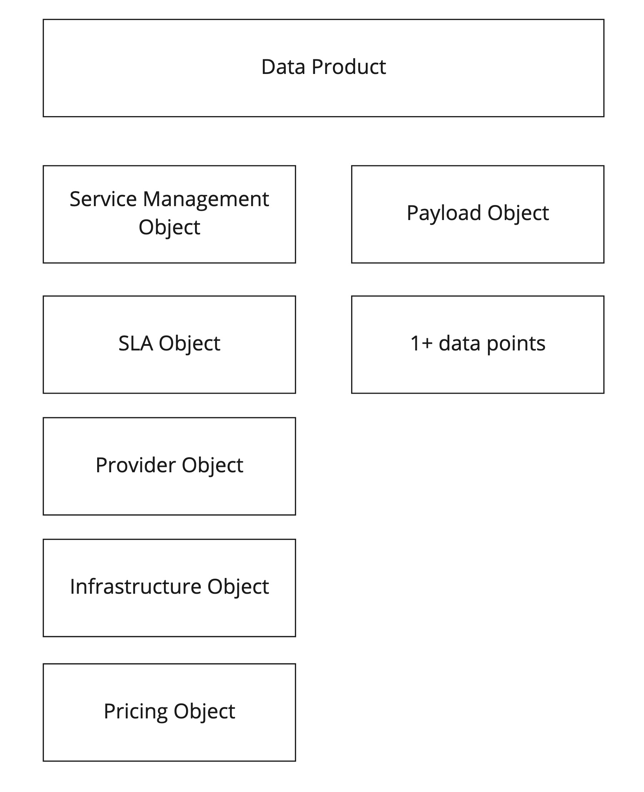

# Data Product Specifation

This Data Product Specification \(DPS\) definition in a vendor neutral and intented to fostering innovation in the area where data is exposed for internal or public use as data products. Open data movement began the data exposure, but it lacks the commercial aspects of data products. Since a specification for the data product has been missing, Platform of Trust decided to ignite open process to define one shared specification and understanding of what is a data product.

This Specification defines Standard Data Product fields and objects. This specification also defines the schemas for responses \(payload\).

