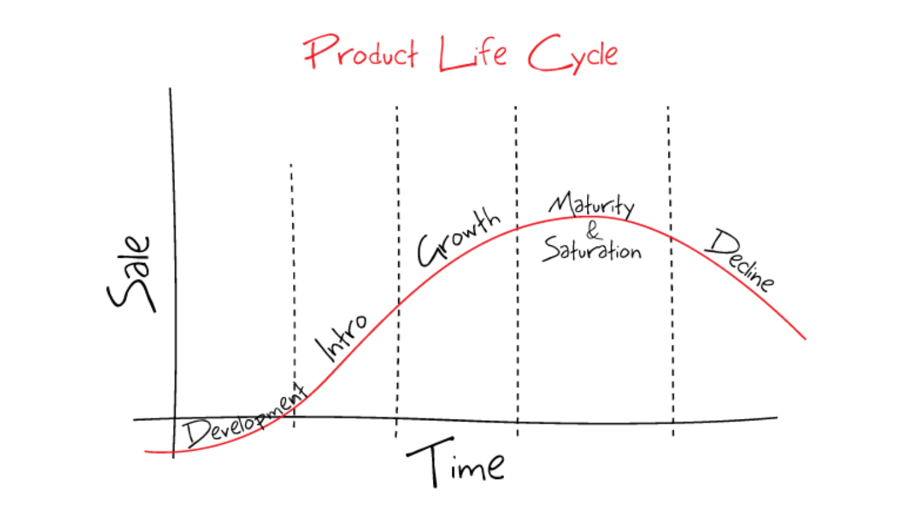

# Data Product lifecycle

Product Lifecycle Management \(PLM\) is the business activity of managing, in the most effective way, a company’s products all the way across their lifecycles; from the very first idea for a product all the way through until it is retired and disposed of.

Data Product follows the traditional product life cycle in phases. Data Product Specification contains necessary attribute options to support each phase: 

* Development
* Introduction
* Growth
* Maturity and saturation
* Decline
* Retirement

