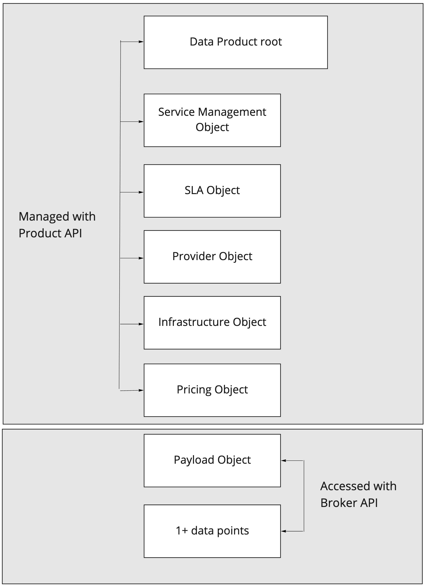

# Data Product

A data product is the item offered for sale. A data product is a commodity. Every data product is made at a cost and each is sold at a price. The price that can be charged depends on the market, the quality, the marketing and the segment that is targeted. Each product has a useful life after which it needs replacement, and a life cycle after which it has to be re-invented.

**A data product needs to be relevant**: the users must have an immediate use for it. A product needs to be functionally able to do what it is supposed to, and do it with a good quality.

**A data product needs to be communicated**_:_ Users and potential users must know why they need to use it, what benefits they can derive from it, and what it does difference it does to their lives. Advertising and 'brand building' best do this.  
  
 **A data product needs a name:** a name that people remember and relate to. A product with a name becomes a brand. It helps it stand out from the clutter of products and names.  
  
**A product should be adaptable**_:_ with trends, time and change in segments, the product should lend itself to adaptation to make it more relevant and maintain its revenue stream.

### Entities of the Data Product

