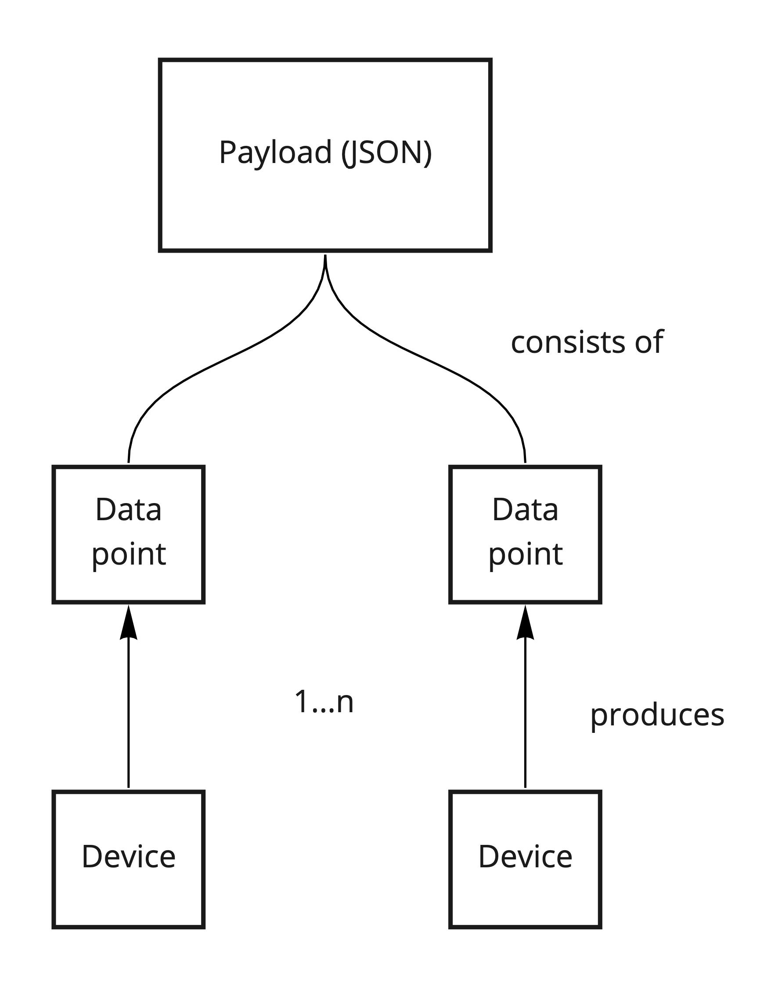

# Payload

Data product contains payload which is a collection of [data points](data-point.md). Of course there is possible situation that building includes just one CO2 measuring device and the data points of that device constitute data product payload. [See examples](https://dataproduct.oftrust.net/terms/payload#three-payload-data-collection-types)

### Three payload data collection types

Payload of data products have fixed schemas defined in ontology. Payload can contain three data streams or value sets: 

1. Current values \(array of objects\)
2. History \(array of objects\)
3. Prediction \(array of objects\)

